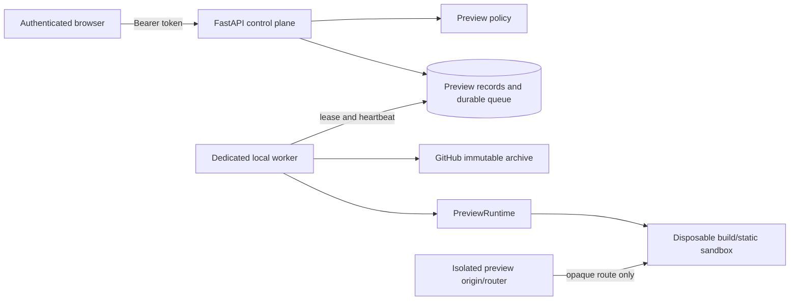

# Isolated previews architecture

Status: local proof of concept; disabled by default; not approved for hostile multi-tenant production.

RepoLive now separates the control plane (Next.js, FastAPI, authentication, policy, database and
job records) from an execution plane (a separately started worker and disposable sandbox). API
requests only validate policy and enqueue durable database work. They never clone, build, or run a
repository. `PreviewRuntime` and `PreviewQueue` contracts keep provider operations out of routes.

The initial profiles are deliberately narrow: a public GitHub repository whose analyzed immutable
tree contains a root `index.html`, or a root-level npm-locked Vite/Create React App frontend with an
exactly approved build script. The trusted runtime either serves that checkout directly or runs
`npm ci --ignore-scripts` and a fixed profile build before serving only the generated static output.
Dockerfiles, unapproved package scripts, start commands, submodules, LFS, symlinks, arbitrary
ports, secrets, writable persistent volumes, and server-rendered applications are rejected.

The database state machine is `requested -> policy_check -> queued -> cloning -> building ->
starting -> ready -> stopping -> destroyed`, with `rejected`, `failed`, `timed_out`, `expired`, and
`canceled` terminal outcomes. Transitions use conditional updates. Events contain sanitized,
bounded messages. A worker lease enables stale-job recovery; retry count and lifetime are bounded.

Local Docker is a developer adapter, not a production security boundary. A production provider
must supply microVM/gVisor/Kata-equivalent isolation, policy-enforced egress, a durable distributed
queue, registrable-domain isolation, TLS routing, distributed abuse controls, metrics and alerts.
Production configuration rejects `local_docker` and fails closed when required providers or routing
configuration are absent.

The local router maps a lowercase cryptographically random `*.preview.localhost` hostname to one
healthy sandbox through a loopback-only relay. Each application sandbox has its own internal Docker
network with no outbound route. The trusted relay receives no source or credentials and exposes only
the paired static server. Untrusted
content must use a registrable domain distinct from RepoLive, without shared cookies or browser
storage. Localhost subdomains prove routing behavior but not production registrable-domain isolation.
